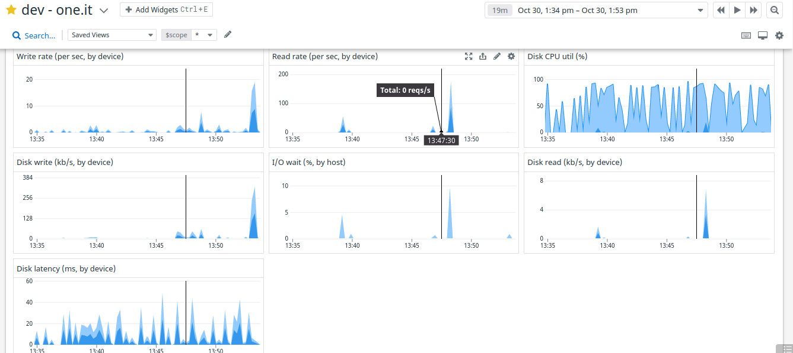

# Description

The following Infrastructure Design for dev-one.it to serve several services that will be run in staging or production environment

# Architecture Design

# Component
* VPC
* Security Group
* Route53
* Elastic Load Balancer
* NAT Gateway
* EC2 Instances
* RDS Proxy
* PostgreSQL

 

# List of EC2 Instances

| Service Name      | IP Private    | Resource      | Availability Zone|
|-------------------|---------------|---------------|------------------|
| api-1.dev-one.it  | 172.31.1.101  | EC2 M3.XLarge |     Zone-1       |
| api-2.dev-one.it  | 172.31.1.102  | EC2 M3 XLarge |     Zone-1       |
| api-3.dev-one.it  | 172.31.1.103  | EC2 M3 XLarge |     Zone-1       |
| api-4.dev-one.it  | 172.31.1.104  | EC2 M3 XLarge |     Zone-1       |
| api-1.dev-one.it  | 172.31.2.101  | EC2 M3 XLarge |     Zone-2       |
| api-2.dev-one.it  | 172.31.2.102  | EC2 M3 XLarge |     Zone-2       |
| api-3.dev-one.it  | 172.31.2.103  | EC2 M3 XLarge |     Zone-2       |
| api-4.dev-one.it  | 172.31.2.104  | EC2 M3 XLarge |     Zone-2       |

 

# Resource and Design
1. I proposed separated zone, so if there's disaster in Zone-A. resources in Zone B will be serve traffic from client
2. Since we have expectation each instance able to handle more thank 10k concurrent connection, we suggest to use EC2 instance with type M3.XLarge. which the instance as high performance specs. Just in case when the traffic reach until 100k, we can apply auto scaling based on cpu utilization
3. VPC : Provide allocation address space
4. ElB as load balancer to distribute load traffic from client toward instance in different zone
5. NAT Gateway : Provide outgoing connection from several intances using IP Static
6. Route53 : Provide highly available and scalable DNS for *.dev-one.it, which handles DNS for both the TCP and UDP traffic requests
7. Security Group : Controll traffic both External or Internal

 

# PoC / Evidence
This is sample of Poc / Evidence that proves EC2 instance with type M3.Xlarge able to handling 10000 request connection

 

 
 

# Monitoring
I proposed using datadog as monitoring tool both infrastructure or application layer. Why I choose datadog rather than other monitoring tools like prometheus etc
* Metric and time series data collection
* Integrations with other tools like Opsgenie, Slack
* Creation of monitors to trigger alarms and notify teams. So if there's issue, the engineer will receive alert notification and we can immnediately to check & troubleshoting related the issue
* Good API documentation and very responsive customer service.
* Datadog using AWS as the main infrastructure, so when we use Cloud infrastruture at the same location/region, we can reduce latency from dd-agent that installed in our infrastructure to API Datadog
 
 

## Server Monitoring

There are many agents that can integrated on server, but in this case I only provide a sample metric that will be used in production

* Concurrent Connections
* Network Traffic Utilization
* CPU Utilization
* Memory Usage
* Uptime 

The following sample agent that provided by datadog and also we can create a custom metric use datadog agent check

 
 

## Applilcation Monitoring

The following sample metric application that will be used in production

* Throughput
* Status Response Code ( 5xx, 2xx, 3xx )
* Latency per request
* API Read Latency
* API Write Latency

